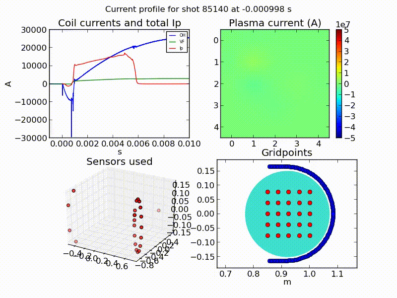
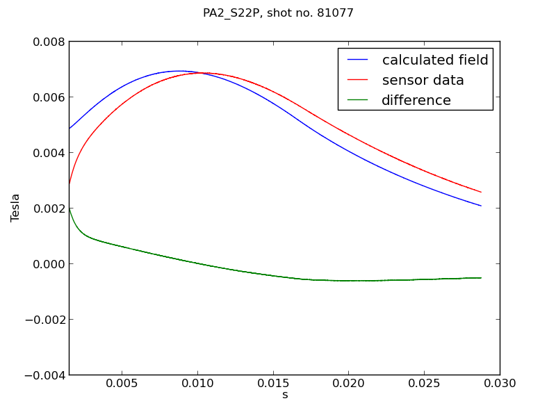

# filament

### To-do

### Code Structure

- __reconstruct_ip.py__
	- Calculates plasma current profile at each time point
	- Saves a movie of current profile evolution
- __fit_eigenmodes.py__
	- Calculates magnitude of eddy currents using eigenmodes
- __eigenmodes.py__
	- Calculates eigenmodes for stainless steel shells
- __tokamak.py__
	- Defines `Sensor` class and methods to obtain coil and sensor timeseries data
	- Establishes geometry of stainless steel shells
	- Loads VF shot data
- __g_matrix.py__
	- Calculates Green's functions between all sensors and coils
	- Saves results in output/inductances(...).p to load in future
- __fields.pyx__
	- Can calculate magnetic field from a loop of current
	- Sped up using Cython, must run `make` before using 
- __data_manipulation.py__
	- Methods for trimming, formatting timeseries data

### Eddy current magnitudes for unique sensors

### Eigenmodes for a single shell

### Current profile reconstruction without eddy currents

### Magnetic field calculation example without eddy currents

