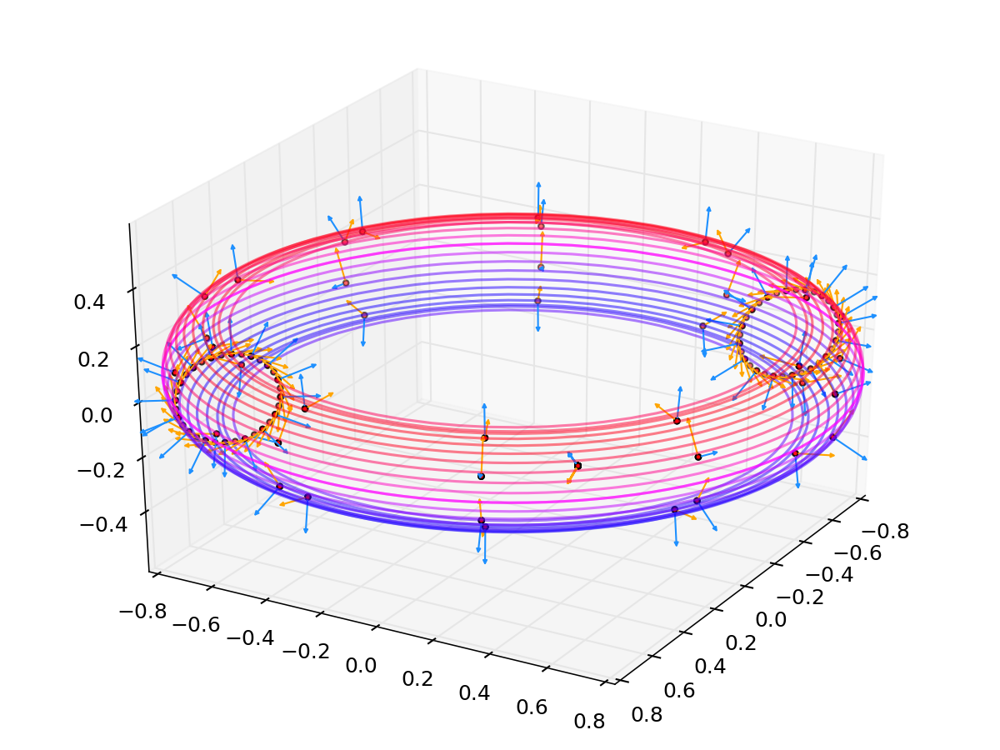
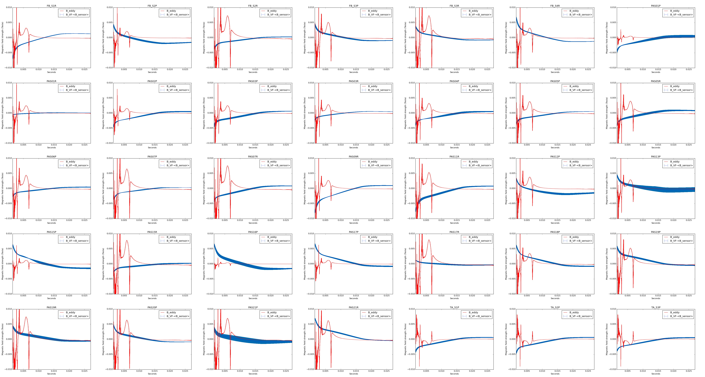

# filament

We model the eddy currents as loops going through the SS shells, colored from red to blue according to the first eigenmode. Poloidal sensors are orange, radial ones are blue.

### Eddy current fit

For each sensor group, we find the difference between the calculated magnetic field from the VF coil and the mean sensor signal, and compare it to the eddy currents obtained from chi-squared minimization.

### Eigenmodes for a single shell

Eigenmodes for different numbers of filaments. Differences seem to be in sign alone. Look at convergence of eigenvalues rather than eigenvector sign.

### Current profile reconstruction without eddy currents

### Greens function matrix

### Magnetic field calculations without eddy currents

Sensors are color-coded:

- Forest green: FB
- Purple: PA
- Turquoise: TA

Note that some bad readings got past the blacklist I created. To do: fix.

### Code Structure

- __reconstruct_ip.py__
	- Plasma current profile at each time point
	- Saves a movie of current profile evolution
- __fit_eigenmodes.py__
	- Find magnitude of eddy currents using eigenmodes
- __eigenmodes.py__
    - `Filament` class
	- Eigenmodes for stainless steel shells
- __tokamak.py__
	- `Sensor` class and methods to obtain coil and sensor timeseries data
	- Establishes geometry of stainless steel shells
	- Loads VF shot data
- __fields.pyx__
	- Magnetic field from a loop of current
	- Uses Cython, `make` before running
- __data_manipulation.py__
	- Methods for trimming, formatting timeseries data

### Resources

- [Intuition for the radial penetration of flux surface shaping in tokamaks](http://iopscience.iop.org/0741-3335/57/3/035006)
- [8.02 Sources of Magnetic Fields](http://web.mit.edu/8.02t/www/802TEAL3D/visualizations/coursenotes/modules/guide09.pdf)

