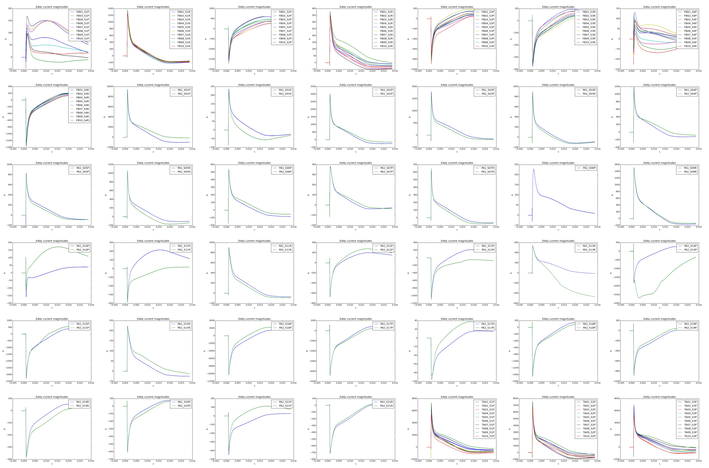

# filament

### Code Structure

- __reconstruct_ip.py__
	- Plasma current profile at each time point
	- Saves a movie of current profile evolution
- __fit_eigenmodes.py__
	- Magnitude of eddy currents using eigenmodes
- __eigenmodes.py__
    - `Filament` class
	- Eigenmodes for stainless steel shells
- __tokamak.py__
	- `Sensor` class and methods to obtain coil and sensor timeseries data
	- Establishes geometry of stainless steel shells
	- Loads VF shot data
- __fields.pyx__
	- Magnetic field from a loop of current
	- Uses Cython, `make` before running
- __data_manipulation.py__
	- Methods for trimming, formatting timeseries data

### Chi-squared distribution

### Eddy current magnitudes 

Sensors with the same r, z positions around the tokamak seem to be in agreement, except for FB...S1P and FB...S4P.

### Eigenmodes for a single shell

Eigenmodes for different numbers of filaments. Differences seem to be in sign alone. Look at convergence of eigenvalues rather than eigenvector sign.

### Current profile reconstruction without eddy currents

### Greens function matrix

### Magnetic field calculations without eddy currents

Sensors are color-coded:

- Forest green: FB
- Purple: PA
- Turquoise: TA

Note that some bad readings got past the blacklist I created. Gotta fix this.

